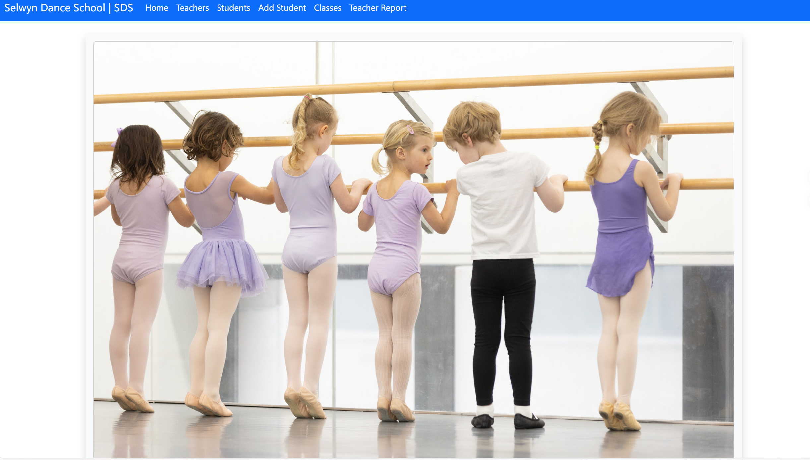
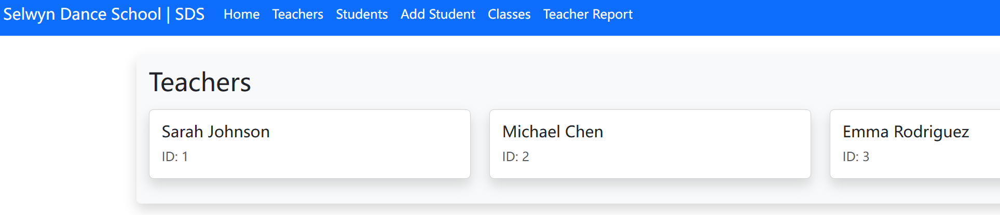
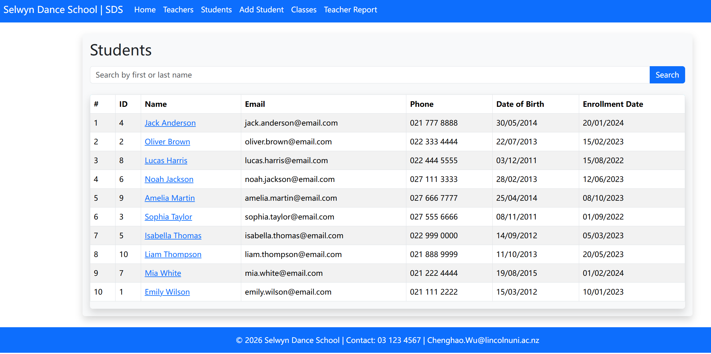
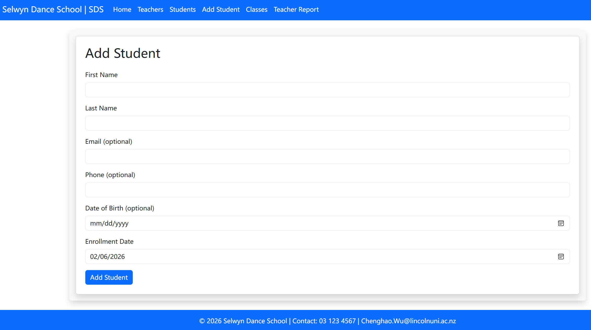
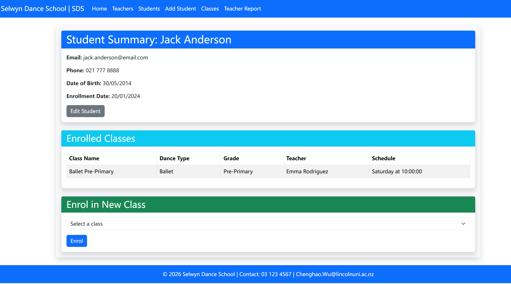
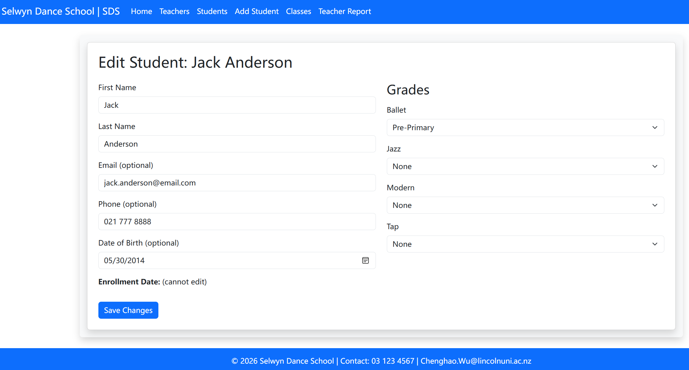
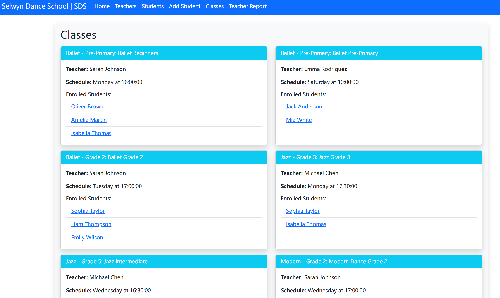

# Selwyn Dance School (SDS) Web Application

This is the web application for Lincoln University's COMP636 assessment. Owner: Chenghao Wu (Student ID: 1171540).

## Project Description

SDS is a Flask-based web application designed to manage a dance school's operations. It allows users to:

- View and manage students, teachers, and classes.
- Enroll students in classes.
- Edit student details and grades.
- Generate teacher reports showing class assignments and student counts.
- Search and filter students.

The application uses MySQL as the database backend and Bootstrap for frontend styling. It includes features like form validation, flash messages for feedback, and date formatting.

Key components:
- **Backend**: Flask (Python web framework), MySQLdb for database connectivity.
- **Frontend**: HTML templates with Jinja2, Bootstrap 5.
- **Database**: MySQL schema with tables for students, teachers, classes, dance types, grades, etc.

## Usage

- **Home**: Overview of the school.
- **Teachers**: List all teachers.
- **Students**: Search and view students; click on a name for summary.
- **Add Student**: Form to add a new student with optional fields.
- **Edit Student**: Update details and assign grades (accessible from student summary).
- **Classes**: View classes with enrolled students.
- **Enroll in Class**: From student summary, select and enroll in available classes.
- **Teacher Report**: View teachers' classes, student counts, and total unique students.

Flash messages will appear for success (green) or errors (red).

### Key Test Cases

1. **Home Page Load**:
   - Navigate to `/`.
   - Expected: Welcome card with image, "Our Classes" and "Join Us!" sections, navigation bar visible.
   - Test: Click "Explore Students" button – should redirect to `/students`.

2. **View Teachers**:
   - Navigate to `/teachers`.
   - Expected: List of 3 sample teachers (Sarah Johnson, Michael Chen, Emma Rodriguez) in cards.
   - Test: If no teachers, shows "No teachers found".

3. **View and Search Students**:
   - Navigate to `/students`.
   - Expected: Table with 10 sample students, including ID, Name (linked), Email, Phone, DOB, Enrollment Date.
   - Test Search: Enter "Emily" in search bar – should show only Emily Wilson.
   - Edge Case: Search for non-existent name (e.g., "XYZ") – shows "No students found".

4. **Add Student**:
   - Navigate to `/add_student`.
   - Fill form: First Name="Test", Last Name="User", Email="test@email.com", Phone="123456", DOB="2000-01-01", Enrollment Date=today.
   - Submit.
   - Expected: Redirect to student summary with flash "Student added successfully". New student appears in student list.
   - Invalid Test: Submit without First/Last Name – form validation prevents submission (Bootstrap validation).

5. **Student Summary and Enrollment**:
   - Navigate to `/student/<id>` (e.g., /student/1 for Emily Wilson).
   - Expected: Details section, enrolled classes table (e.g., Ballet Grade 2), enroll form with available classes.
   - Test Enroll: Select a class (e.g., Ballet Beginners) and submit – flash "Enrolled successfully", class added to table.
   - Edge Case: If no available classes, shows "No available classes for enrolment."

6. **Edit Student**:
   - From student summary, click "Edit Student".
   - Update First Name to "Edited Emily", select a new grade for Ballet.
   - Submit.
   - Expected: Redirect to summary with updated details and flash "Student updated successfully".
   - Test: DOB invalid format – flash error.

7. **View Classes**:
   - Navigate to `/classes`.
   - Expected: Cards for each class (e.g., Ballet Beginners) showing teacher, schedule, and enrolled students (linked).
   - Test: Click a student link – redirects to their summary.

8. **Teacher Report**:
   - Navigate to `/teacher_report`.
   - Expected: Cards for each teacher with classes table (e.g., Sarah Johnson: Ballet Beginners with student count), total unique students.
   - Test: Add a student to a class and refresh – counts update.

9. **Error Handling**:
   - Invalid URL (e.g., /student/999) – Flask debug page or redirect (depending on code).
   - Database Error: Stop MySQL server and reload page – should show connection error in console.
